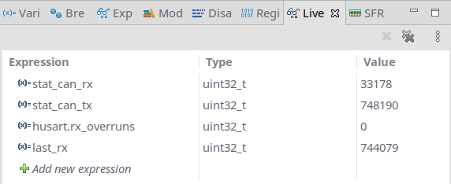
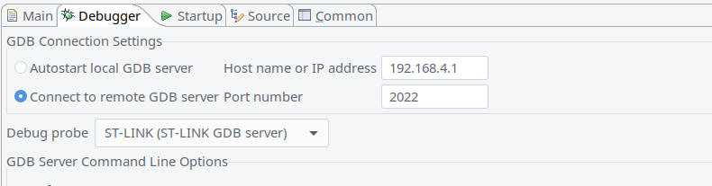

# Introduction

blackmagic-espidf is a project which aims to support debugging SWD and JTAG targets over wifi by integrating [blackmagic](https://github.com/blacksphere/blackmagic) probe firmware to the espressif IDF platform for esp8266.

## Features
- **NEW** Automatic Attach to target on connect to GDB server
- **NEW** Live Expressions support in STM32CubeIDE
- **NEW** Non-Stop GDB protocol and multiple GDB connections (beta)
- All the debug features and supported targets of the [blackmagic](https://github.com/blacksphere/blackmagic) firmware:
  * Targets ARM Cortex-M and Cortex-A based microcontrollers.
  * Connects to the target processor using the JTAG or Serial Wire Debug (SWD) interface.
  * Provides full debugging functionality, including: watchpoints, flash memory breakpoints, memory and register examination, flash memory programming, etc.
  * Load your application into the target Flash memory or RAM.
  * Single step through your program.
  * Run your program in real-time and halt on demand.
  * Examine and modify CPU registers and memory.
  * Obtain a call stack backtrace.
  * Set up to 6 hardware assisted breakpoints.
  * Set up to 4 hardware assisted read, write or access watchpoints.
  * Set unlimited software breakpoints when executing your application from RAM.
- Implements the GDB extended remote debugging protocol for seamless integration with the GNU debugger and other GNU development tools.
- GDB server on TCP port 2022
- Serial port server on TCP port 23
- Serial port over websocket on embedded http server (powered by xterm.js) @ http://192.168.4.1
- OTA updates over tftp
- Platform/BMP debug messages terminal over http://192.168.4.1/debug.html

## 

Live Expressions in STMCubeIDE
##  

STMCubeIDE settings
## 

## 

## Supported Targets:
<p align="center">
<a href="https://raw.githubusercontent.com/wiki/blacksphere/blackmagic/images/bmpm_ARM_Cortex-M_targets-2021.png"></a><br/>
<a href="https://raw.githubusercontent.com/wiki/blacksphere/blackmagic/images/bmpm_ARM_Cortex-A_alpha_targets.png"></a>
</p>

## Requirements

esp8266 module with >= 2MB flash. Default configuration is set for 4MB flash for OTA updates. It's possible to configure for other flash sizes. see `make menuconfig`

By disabling OTA it should work on 1MB devices.

## GPIO defaults for esp8266

GPIO0 - SWDIO

GPIO2 - SWCLK

TX0 - UART TXD

RX0  - UART RXD

## Serial terminal

Connecting to serial terminal can be done using socat:

```
socat tcp:192.168.4.1:23,crlf -,echo=0,raw,crlf
```

## Building

Grab the toolchain from https://github.com/espressif/ESP8266_RTOS_SDK#developing-with-the-esp8266_rtos_sdk  and add it to $PATH.

```bash
git clone --recursive https://github.com/walmis/blackmagic-espidf.git
cd blackmagic-espidf
make menuconfig # optional, if you want to change some settings
make
make flash # this will flash using esptool.py over serial connection
```

### Station Mode Configuration

To use the ESP8266 in Station mode, in the Blackmagic configuration section:
- Configure Station mode
- Specify the SSID and password you wish to connect to.  *NOTE: The SSID is case sensitive*
- (optional) Specify a hostname to make it easier to connect to the probe.

### Development/Debug Configuration

When working on blackmagic-espidf it is frequently desirable to continue to use the ESP8266 UART for debugging.  To achieve this you can disable `Monitor target UART` in the Blackmagic configuration section.

In this mode you will be unable to use the ESP UART to monitor the target and connecting the ESP UART to the target may result in undefined behavior since the debug messages will be sent to the target.

## OTA Flashing

If the firmware is already on the esp8266 device, it is possible to flash using tftp. Make sure you have tftp-hpa package installed then run:

```bash
make tftpflash
```

## Buy me a coffee

If you find this project useful, consider buying me a coffee :-)

[](https://www.paypal.com/cgi-bin/webscr?cmd=_s-xclick&hosted_button_id=66JLPHXMD3XW2)

Don't forget to support Blackmagic developers ! 

