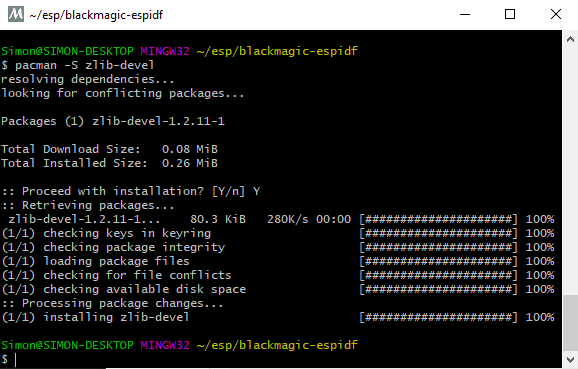

# Introduction

blackmagic-espidf is a project which aims to support debugging SWD and JTAG targets over wifi by integrating blackmagic probe firmware to the espressif IDF platform for esp8266 and esp32.

## Features

- All the debug features and supported targets of the blackmagic firmware
- GDB server on TCP port 2022 and UDP port 2023
- Serial port server on TCP port 23 and UDP port 2323
- Serial port over websocket on embedded http server (powered by xterm.js) @ http://192.168.4.1
- OTA updates over tftp
- Platform debug messages terminal over http://192.168.4.1/debug.html

## 

## 

## Requirements

esp8266 module with >= 2MB flash. Default configuration is set for 4MB flash for OTA updates. It's possible to configure for other flash sizes. see `make menuconfig`

By disabling OTA it should work on 1MB devices.

## Default ESP8266 GIPO pins:

| GIPO | WeMos | JTAG | SWD | ARM 10 pin |
|------|-------|------|-----|------------|
| GPIO=0 | D3 | TMS | SWDIO | 2 |
| GPIO=2 | D4 | TCK | SWCLK | 4 |
| GPIO=14 | D5 | TDO | SWO | 6 |
| GPIO=13 | D7 | TDI | - | 8 |
| GPIO=12 | 63 | nRESET | - | 10 |
| GPIO=1 | TX | - | - | - |
| GPIO=3 | RX | - | - | - |


## Serial terminal

Connecting to serial terminal can be done using socat:

```
socat tcp:192.168.4.1:23,crlf -,echo=0,raw,crlf
```

## Building

Grab the toolchain from https://github.com/espressif/ESP8266_RTOS_SDK#developing-with-the-esp8266_rtos_sdk  and add it to $PATH.

```bash
git clone --recursive https://github.com/walmis/blackmagic-espidf.git
cd blackmagic-espidf
make menuconfig # optional, if you want to change some settings
make
make flash # this will flash using esptool.py over serial connection
```

You may also need to install ZLIB using MINGW32, and the command `pacman -S zlib-devel`.

## 

## Flash precompiled ESP8266 firmware

Download all *.bin files from folder [firmware](https://github.com/Jason2866/blackmagic-espidf/tree/master/firmware) and flash via esptool.py with command:

```
esptool.py --chip esp8266 --baud 115200 --before default_reset --after hard_reset write_flash -z --flash_mode dout --flash_freq 80m --flash_size 4MB 0xd000 ota_data_initial.bin 0x0000 bootloader.bin 0x10000 blackmagic.bin 0x8000 partitions_two_ota.bin
```

## STA Fix:

in main/platform.c

```bash
- #if CONFIG_ESP_WIFI_MODE_STA  
+ #if CONFIG_ESP_WIFI_IS_STATION 
```
changend line 417 and 468


## OTA Flashing

If the firmware is already on the esp8266 device, it is possible to flash using tftp. Make sure you have tftp-hpa package installed then run:

```bash
make tftpflash
```


## More Info and Howto:
Instruction and download at [Visualmicro](https://www.visualmicro.com/page/Create-a-WiFi-Black-Magic-GDB-Probe-from-ESP8266.aspx)
