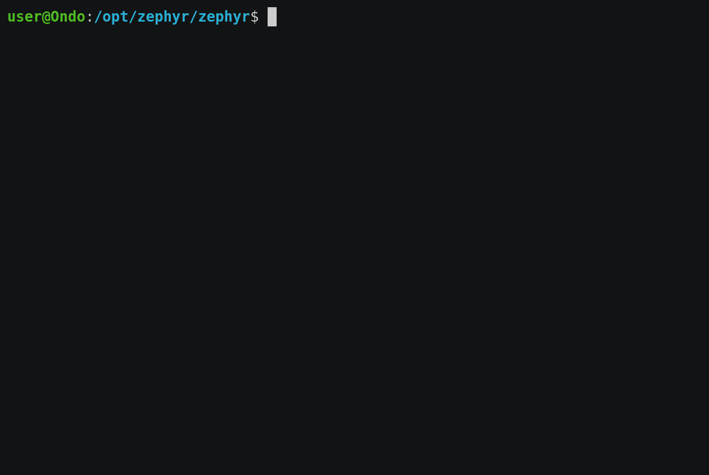

# Introduction

Farpatch is a hardware debugger that is powered off of the `VTref` pin of a debug port and presents a wifi interface. This enables debugging JTAG and SWD remotely in systems that otherwise might be difficult to reach.

It is powered by the [blackmagic](https://github.com/blacksphere/blackmagic) project.

This was originally based on [blackmagic-espidf for ESP8266](https://github.com/walmis/blackmagic-espidf) and has undergone extensive rework.

## Features

- Powered by the target using `VTref`
- Compatible with 1.8V - 5V targets
- Built-in web server with serial terminal
- RTT support for serial-over-debug
- GDB server on TCP port 2022 (configurable)
- Serial port on TCP port 23
- Wifi configuration via web interface
- OTA updates over tftp
- No drivers needed on the host PC
- All the debug features and supported targets of the [blackmagic](https://github.com/blacksphere/blackmagic) firmware:
  - Targets ARM Cortex-M and Cortex-A based microcontrollers.
  - Connects to the target processor using the JTAG or Serial Wire Debug (SWD) interface.
  - Provides full debugging functionality, including: watchpoints, flash memory breakpoints, memory and register examination, flash memory programming, etc.
  - Load your application into the target Flash memory or RAM.
  - Single step through your program.
  - Run your program in real-time and halt on demand.
  - Examine and modify CPU registers and memory.
  - Obtain a call stack backtrace.
  - Set up to 6 hardware assisted breakpoints.
  - Set up to 4 hardware assisted read, write or access watchpoints.
  - Set unlimited software breakpoints when executing your application from RAM.
- Implements the GDB extended remote debugging protocol for seamless integration with the GNU debugger and other GNU development tools.

## Built-in Terminal


## GDB Server on Port 2022



## Supported Targets

Supports many ARM Cortex-M and Cortex-A targets. See the list at the [Blackmagic Repository](https://github.com/blackmagic-debug/blackmagic/wiki#supported-targets)

## Requirements

ESP32 module with >= 4MB flash. It's possible to configure for other flash sizes. see `idf.py menuconfig`

## GPIO defaults for ESP32

You can adjust the GPIO defaults by running `idf.py menuconfig`.

## Serial terminal

Connecting to serial terminal can be done using socat:

```text
socat tcp:$FARPATCH_IP:23,crlf -,echo=0,raw,crlf
```

## Building

The easiest way to build is to install the [Visual Studio Code extension](https://marketplace.visualstudio.com/items?itemName=espressif.esp-idf-extension) for ESP-IDF. This will offer to install esp-idf for you. Select the `master` branch.

You can then build by pressing `Ctrl-E Ctrl-B`.

Alternately, if you have `esp-idf` installed, you can use `idf.py` to build it under Windows or Linux:

```bash
git clone --recursive https://github.com/farpatch/farpatch.git
cd farpatch
idf.py menuconfig
idf.py make
```

## OTA Flashing

If the firmware is already on the device, it is possible to flash using tftp. Make sure you have tftp-hpa package installed then run:

```bash
tftp -v -m octet $FARPATCH_IP -c put build/blackmagic.bin firmware.bin
```