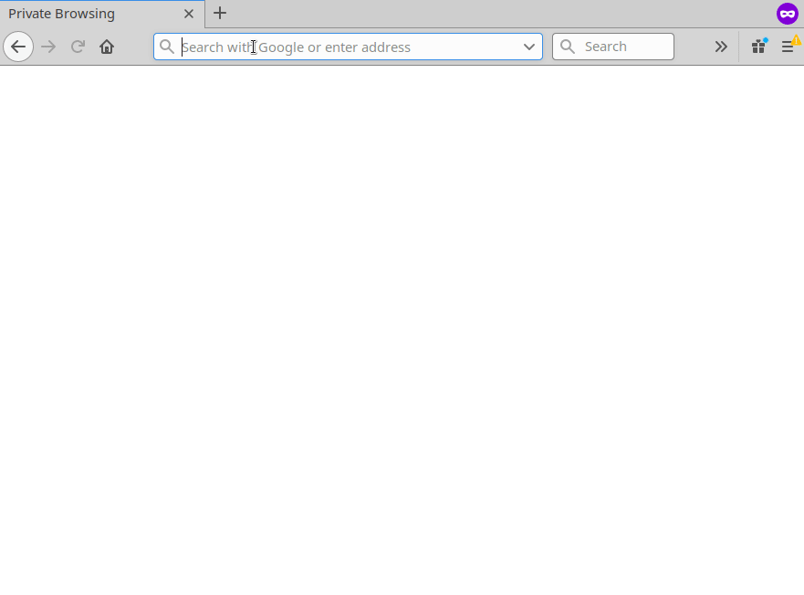
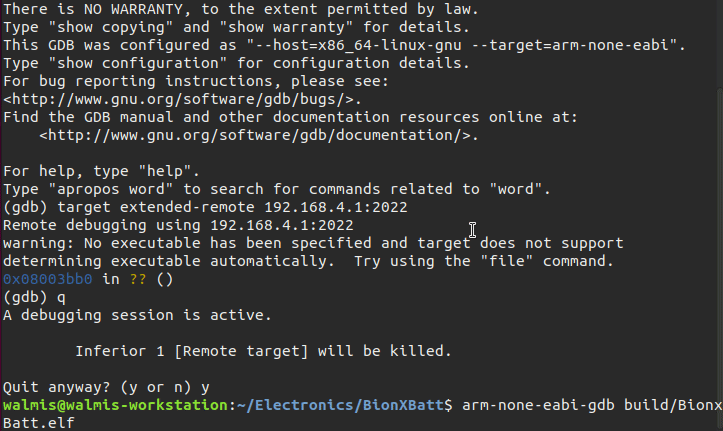

# Introduction

blackmagic-espidf is a project which aims to support debugging SWD and JTAG targets over wifi by integrating blackmagic probe firmware to the espressif IDF platform for esp8266 and esp32.

## Features

- All the debug features and supported targets of the blackmagic firmware
- GDB server on TCP port 2022 and UDP port 2023
- Serial port server on TCP port 23 and UDP port 2323
- Serial port over websocket on embedded http server (powered by xterm.js) @ http://192.168.4.1
- OTA updates over tftp
- Platform debug messages terminal over http://192.168.4.1/debug.html

## 

## 

## Requirements

esp8266 module with >= 2MB flash. Default configuration is set for 4MB flash for OTA updates. It's possible to configure for other flash sizes. see `make menuconfig`

By disabling OTA it should work on 1MB devices.

## Default ESP8266 GIPO pins:

| GIPO | WeMos | JTAG | SWD | ARM 10 pin |
|------|-------|------|-----|------------|
| GPIO=0 | D3 | TMS | SWDIO | 2 |
| GPIO=2 | D4 | TCK | SWCLK | 4 |
| GPIO=14 | D5 | TDO | SWO | 6 |
| GPIO=13 | D7 | TDI | - | 8 |
| GPIO=12 | D6 | nRESET | - | 10 |
| GPIO=1 | TX | - | - | - |
| GPIO=3 | RX | - | - | - |


## Serial terminal

Connecting to serial terminal can be done using socat:

```
socat tcp:192.168.4.1:23,crlf -,echo=0,raw,crlf
```

## Building

Grab the toolchain from https://github.com/espressif/ESP8266_RTOS_SDK#developing-with-the-esp8266_rtos_sdk  and add it to $PATH.

```bash
git clone --recursive https://github.com/walmis/blackmagic-espidf.git
cd blackmagic-espidf
make menuconfig # optional, if you want to change some settings
make
make flash # this will flash using esptool.py over serial connection
```


## OTA Flashing

If the firmware is already on the esp8266 device, it is possible to flash using tftp. Make sure you have tftp-hpa package installed then run:

```bash
make tftpflash
```
### Station Mode Configuration

To use the ESP8266 in Station mode, in the Blackmagic configuration section:
- Configure Station mode
- Specify the SSID and password you wish to connect to.  *NOTE: The SSID is case sensitive*
- (optional) Specify a hostname to make it easier to connect to the probe.

### Development/Debug Configuration

When working on blackmagic-espidf it is frequently desirable to continue to use the ESP8266 UART for debugging.  To achieve this you can disable `Monitor target UART` in the Blackmagic configuration section.

In this mode you will be unable to use the ESP UART to monitor the target and connecting the ESP UART to the target may result in undefined behavior since the debug messages will be sent to the target.

## Binaries:
Instruction and download at [Visualmicro](https://www.visualmicro.com/page/Create-a-WiFi-Black-Magic-GDB-Probe-from-ESP8266.aspx)
